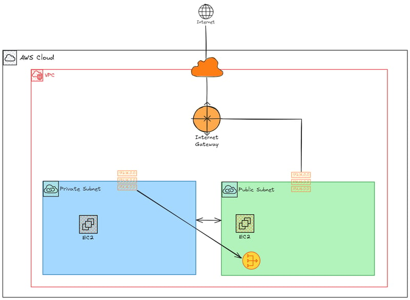

## Terraform

Create a key pair (maybe name it rootkey for now) in AWS. Must have aws cli installed (`pip install awscli`) 
and aws configured (`aws configure`).

### Architecture




### Setup

```bash
terraform init
```

```bash
terraform plan
```

```bash
terraform apply
```


